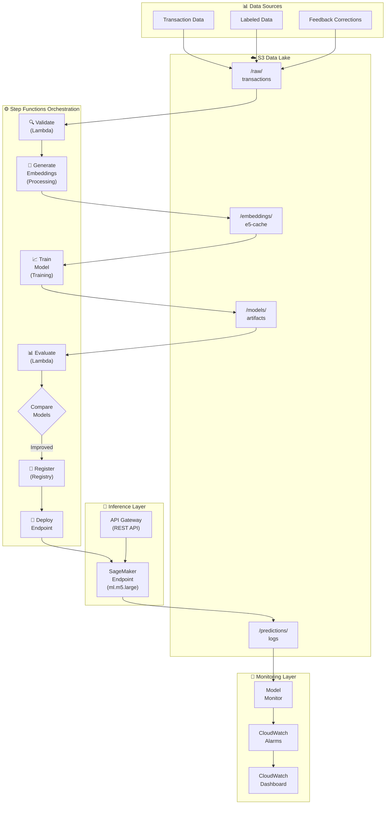

# Green Finance AI: Transaction Classification System

A production-grade ML system for classifying financial transactions into 10 categories, featuring systematic experimentation, label contamination analysis, and AWS MLOps architecture.

**Key Result:** 73.4% accuracy | 0.625 Macro F1 — near the theoretical ceiling given fundamental data constraints.

---

## 🎯 The Problem

Classify 8,000 financial transactions into 10 categories based on transaction descriptions.

| Challenge | Details |
|-----------|---------|
| **Severe Class Imbalance** | Retail Trade: 33.7% vs Finance: 0.5% (67x ratio) |
| **Noisy Text Data** | Transaction descriptions with inconsistent formatting |
| **Semantic Overlap** | Multiple categories share vocabulary (e.g., "university" appears in both Education and Retail) |

### Category Distribution

```
Retail Trade                              ████████████████████████████████████  33.8%
Entertainment                             ████████████████████████████          28.1%
Trade, Professional and Personal Services █████████████                         13.2%
Health and Community Services             ██████████                            10.4%
Services to Transport                     █████                                  5.8%
Travel                                    ███                                    3.7%
Property and Business Services            ██                                     2.7%
Education                                 █                                      1.1%
Communication Services                    █                                      0.7%
Finance                                   █                                      0.5%
```

---

## 💡 The Key Insight: Label Contamination

**The most important finding wasn't a model improvement—it was understanding why improvement has limits.**

Initial hypothesis: *"Rare class samples lack discriminative keywords."*

**Actual root cause:** *"The same keywords appear in multiple categories with conflicting labels."*

### The Smoking Gun

When the model sees "university" in transaction text:

| Category | Samples with "university" | Share |
|----------|---------------------------|-------|
| Retail Trade | 184 | **51.9%** |
| Education | 171 | 48.1% |

The model *cannot* learn that "university" → Education because training data says it's more likely Retail Trade.

### Why This Happens: MCC Code Mismatch

Labels are based on **Merchant Category Codes** (business type), but model learns from **text** (transaction context):

| Merchant | MCC Category | Text Signal | Label |
|----------|--------------|-------------|-------|
| Princeton University Bookstore | Bookstore | "university" | Retail Trade |
| University of Arizona Bookstore | Bookstore | "university" | Retail Trade |
| Verizon Wireless Retailer | Electronics | "wireless" | Retail Trade |

**The fundamental problem:** A university bookstore is labeled Retail Trade (correct by MCC), but the text says "university" (Education signal). These are two different classification tasks forced into one.

### Signal Purity vs Model Performance

| Category | Signal Purity | Model Precision | Gap |
|----------|---------------|-----------------|-----|
| Finance | 64.1% | 0.64 | 0% |
| Education | 48.8% | 0.45 | 3.8% |
| Communication Services | 24.1% | 0.52 | — |

**The model is performing near the theoretical maximum given label contamination.**

---

## 📈 Methodology & Results

### Systematic Experimentation

| Stage | Approach | Accuracy | Macro F1 | Δ F1 |
|-------|----------|----------|----------|------|
| 1 | Baseline (Logistic Regression + MiniLM) | 0.630 | 0.490 | — |
| 2 | Structured Input | 0.630 | 0.490 | +0.0% |
| 3 | LinearSVC | 0.650 | 0.540 | +5.0% |
| 4 | RBF Kernel (C=1.0) | 0.700 | 0.590 | +5.0% |
| 5 | E5-base Embeddings | 0.720 | 0.610 | +2.0% |
| 6 | Tempered Class Weights (α=0.25) | **0.734** | **0.625** | +1.5% |

**Total improvement: +10.4% accuracy, +13.5% Macro F1**

### Final Model Configuration

```python
# Best performing configuration
Embeddings: E5-base (intfloat/e5-base-v2)
Classifier: RBF SVM (C=2.0, gamma='scale')
Class Weights: Tempered (α=0.25)
```

### Per-Class Performance

| Category | Precision | Recall | F1-Score | Support |
|----------|-----------|--------|----------|---------|
| Communication Services | 0.52 | 0.43 | 0.47 | 56 |
| Education | 0.45 | 0.53 | 0.49 | 89 |
| Entertainment | 0.80 | 0.81 | 0.81 | 2,251 |
| Finance | 0.64 | 0.38 | 0.47 | 37 |
| Health and Community Services | 0.89 | 0.81 | 0.84 | 832 |
| Property and Business Services | 0.58 | 0.32 | 0.41 | 219 |
| Retail Trade | 0.67 | 0.78 | 0.72 | 2,700 |
| Services to Transport | 0.76 | 0.65 | 0.70 | 463 |
| Trade, Professional and Personal Services | 0.71 | 0.59 | 0.64 | 1,055 |
| Travel | 0.71 | 0.68 | 0.70 | 298 |

---

## ❌ What I Tried That Didn't Work

This section shows rigorous experimentation and knowing when to stop.

| Approach | Result | Why It Failed |
|----------|--------|---------------|
| **Hierarchical Classification** | Accuracy: 0.63 | Black hole problem persisted at super-category level |
| **NER Masking** | -0.26% accuracy | Location context provides signal, not just noise; 6x slower |
| **Cascade Classifier** | -4.2% accuracy | Inverted the black hole—Stage 1 massively over-predicted rare classes |
| **Random Oversampling (5x)** | -0.7% accuracy | Added noise; precision suffered for tiny recall gains |
| **LightGBM** | Finance F1: 0.05 | Catastrophic tail class performance; SVM clearly superior |
| **Feature Concatenation** | -5% accuracy | 384 embedding dims dominated 16 engineered features |

### Key Learning

Many "standard" approaches (hierarchical classification, oversampling, ensemble methods) failed because **the problem is upstream in the data**, not solvable by model architecture changes.

---

## 🏗️ Architecture

### System Overview



### AWS Services Used

| Layer | Services | Purpose |
|-------|----------|---------|
| **Data** | S3, Glue Catalog | Raw data, embeddings cache, model artifacts |
| **Training** | SageMaker Training/Processing, Step Functions | Model training, pipeline orchestration |
| **Inference** | SageMaker Endpoints, API Gateway | Real-time predictions |
| **Monitoring** | CloudWatch, Model Monitor, SNS | Drift detection, alerting |

### Design Decisions

| Decision | Rationale |
|----------|-----------|
| **RBF SVM over Neural Networks** | Better performance on tabular/embedding data with limited samples |
| **E5-base over MiniLM** | +2.1% accuracy; better semantic understanding |
| **SageMaker over Lambda** | Embedding generation exceeds Lambda's 15-min timeout |
| **Real-time Endpoint over Serverless** | E5-base cold start (15-30s) unacceptable for serverless |
| **Tempered weights (α=0.25) over balanced** | Lighter balancing preserves head-class performance |

---

## 🚀 Run It Yourself

### Local Demo (No AWS Required)

```bash
# Clone the repository
git clone https://github.com/yourusername/green-finance-ai.git
cd green-finance-ai

# Install dependencies
pip install -r requirements.txt

# Run the demo
python demo.py
```

The demo loads the trained model and lets you classify sample transactions interactively.

### Requirements

```
scikit-learn>=1.3.0
sentence-transformers>=2.2.0
pandas>=2.0.0
numpy>=1.24.0
joblib>=1.3.0
streamlit>=1.28.0  # for web demo
```

---

## 📁 Project Structure

```
green-finance-ai/
├── README.md
├── requirements.txt
├── demo.py                          # Interactive demo
├── src/
│   ├── data/
│   │   ├── preprocessing.py         # Text cleaning, structured input
│   │   └── analysis.py              # Label contamination analysis
│   ├── embeddings/
│   │   ├── e5_encoder.py            # E5-base embedding generation
│   │   └── cache.py                 # Embedding caching utilities
│   ├── models/
│   │   ├── svm_classifier.py        # RBF SVM with tempered weights
│   │   ├── train.py                 # Training pipeline
│   │   └── evaluate.py              # Metrics computation
│   └── api/
│       └── inference.py             # Prediction endpoint logic
├── notebooks/
│   ├── 01_data_exploration.ipynb
│   ├── 02_embedding_analysis.ipynb
│   ├── 03_model_experiments.ipynb
│   └── 04_label_contamination.ipynb
├── infrastructure/
│   ├── architecture.mermaid         # Architecture diagram
│   ├── mlops_architecture.md        # Detailed architecture doc
│   └── cdk/                         # AWS CDK infrastructure code
├── models/
│   └── best_model.joblib            # Trained model artifact
├── docs/
│   └── project_logs.pdf             # Detailed experiment logs
└── tests/
    └── test_classifier.py
```

---

## 📊 Confusion Matrix Analysis

### Top Confusions (Actual → Predicted)

| From | To | Count | % of Actual |
|------|-----|-------|-------------|
| Entertainment | Retail Trade | 364 | 16.2% |
| Trade/Professional | Retail Trade | 298 | 28.2% |
| Retail Trade | Entertainment | 285 | 10.6% |
| Services to Transport | Retail Trade | 113 | 24.4% |
| Property/Business | Retail Trade | 87 | 39.7% |

**The "Retail Trade Black Hole":** Every category bleeds 10-40% of samples into Retail Trade due to shared vocabulary and label contamination.

### Rare Class Analysis

| Class | Correct | Misclassified to Retail | Other Errors |
|-------|---------|------------------------|--------------|
| Finance (n=37) | 37.8% | 27.0% | 35.2% |
| Communication (n=56) | 42.9% | 35.7% | 21.4% |
| Education (n=89) | 52.8% | 27.0% | 20.2% |

---

## 🎓 Lessons Learned

1. **Label quality bounds model performance.** No architecture can fix upstream data problems.

2. **Systematic experimentation beats intuition.** Many "obvious" improvements (hierarchical classification, oversampling) made things worse.

3. **Know when you've hit the ceiling.** Understanding theoretical limits is as valuable as pushing performance.

4. **The insight matters more than the number.** "73% accuracy near theoretical max due to label contamination" is a stronger story than "achieved 73% accuracy."

5. **Document failures.** What didn't work (and why) demonstrates deeper understanding than what did.

---

## 📚 Detailed Documentation

- [Project Logs (PDF)](docs/project_logs.pdf) — Complete experiment journal with all iterations
- [AWS Architecture (MD)](infrastructure/mlops_architecture.md) — Detailed MLOps design
- [Architecture Diagram (Mermaid)](infrastructure/architecture.mermaid) — Visual system overview

---

## 🛠️ Technology Stack

| Category | Technology |
|----------|------------|
| **ML Framework** | scikit-learn 1.3+ |
| **Embeddings** | E5-base (HuggingFace) |
| **Cloud** | AWS (SageMaker, S3, Lambda, Step Functions) |
| **IaC** | AWS CDK (Python) |
| **CI/CD** | GitHub Actions |

---

## 📬 Contact

**Smit Patel**
- LinkedIn: [your-linkedin]
- Email: [your-email]
- Portfolio: [your-portfolio]

---

## License

MIT License - see [LICENSE](LICENSE) for details.
